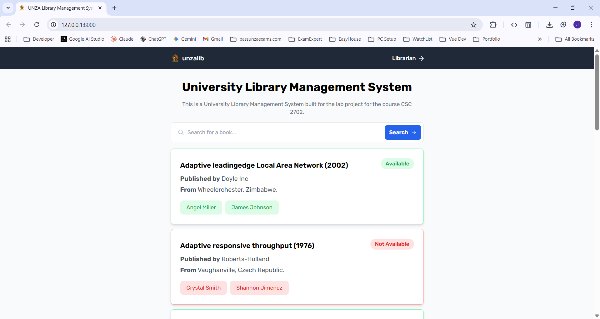
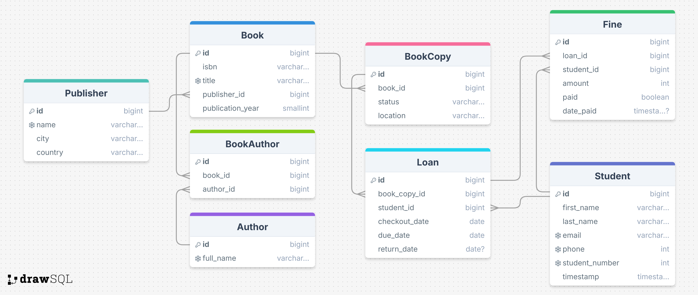

# University Library Management System



## Demo Setup Documentation

## Table of Contents

1. [System Requirements](#1-system-requirements)
2. [Installation Guide](#2-installation-guide)
3. [Project Setup](#3-project-setup)
4. [Database Configuration](#4-database-configuration)
5. [Running the Application](#5-running-the-application)
6. [Testing](#6-testing)
7. [Troubleshooting](#7-troubleshooting)
8. [Screenshots of UI/App]

## 1. System Requirements

### 1.1 Minimum Hardware Requirements

-   Processor: 2.0 GHz dual-core processor or better
-   RAM: 4GB minimum (8GB recommended)
-   Storage: 10GB free space

### 1.2 Software Requirements

-   Python 3.9 or higher
-   PostgreSQL 14.0 or higher
-   pip (Python package manager)
-   Git (for version control)

## 2. Installation Guide

### 2.1 Installing Python

#### Windows

1. Download Python from [python.org](https://www.python.org/downloads/)
2. Run the installer
3. Check "Add Python to PATH"
4. Click "Install Now"
5. Verify installation:

```bash
python --version
```

#### Linux (Ubuntu/Debian)

```bash
sudo apt update
sudo apt install python3 python3-pip
python3 --version
```

#### macOS

```bash
brew install python
python3 --version
```

### 2.2 Installing PostgreSQL

#### Windows

1. Download PostgreSQL from [postgresql.org](https://www.postgresql.org/download/windows/)
2. Run the installer
3. Set a password for the postgres user
4. Keep the default port (5432)
5. Finish installation

#### Linux (Ubuntu/Debian)

```bash
sudo apt update
sudo apt install postgresql postgresql-contrib
sudo systemctl start postgresql
sudo systemctl enable postgresql
```

#### macOS

```bash
brew install postgresql
brew services start postgresql
```

## 3. Project Setup

### 3.1 Clone the Repository

```bash
git clone https://github.com/Mwale-Jonathan/database-lab-project.git
cd database-lab-project/project_ui
```

### 3.2 Create and Activate Virtual Environment

#### Windows (cmd)

```bash
python -m venv venv
venv\Scripts\activate
```

#### Windows (powershell)

```bash
python -m venv venv
venv\Scripts\activate.ps1
```

#### Linux/macOS

```bash
python3 -m venv venv
source venv/bin/activate
```

### 3.3 Install Dependencies

```bash
pip install -r requirements.txt
```

Required dependencies (requirements.txt):

```bash
asgiref==3.8.1
Django==5.1.2
django-cleanup==9.0.0
django-dotenv==1.4.2
django-htmx==1.19.0
django-unfold==0.40.0
Faker==30.4.0
pillow==11.0.0
psycopg2==2.9.9
python-dateutil==2.9.0.post0
six==1.16.0
sqlparse==0.5.1
typing_extensions==4.12.2
tzdata==2024.2
```

## 4. Database Configuration

### 4.1 Create Database

Login to PostgreSQL:

```bash
# Windows
psql -U postgres

# Linux/macOS
sudo -u postgres psql
```

Create database and user:

```sql
CREATE DATABASE library_db;
CREATE USER library_user WITH PASSWORD 'your_password';
ALTER ROLE library_user SET client_encoding TO 'utf8';
ALTER ROLE library_user SET default_transaction_isolation TO 'read committed';
ALTER ROLE library_user SET timezone TO 'UTC';
GRANT ALL PRIVILEGES ON DATABASE library_db TO library_user;
```

### 4.2 Create Database Tables

Connect to the library database:

```bash
# Windows
psql -U postgres -d library_db

# Linux/macOS
sudo -u postgres psql -d library_db
```

Execute the following SQL commands:

```sql
-- Create BookCopy table
CREATE TABLE "BookCopy"(
    "id" bigserial NOT NULL,
    "book_id" BIGINT NOT NULL,
    "status" VARCHAR(50) NOT NULL,
    "location" VARCHAR(255) NOT NULL
);
ALTER TABLE
    "BookCopy" ADD PRIMARY KEY("id");

-- Create Author table
CREATE TABLE "Author"(
    "id" bigserial NOT NULL,
    "full_name" VARCHAR(255) NOT NULL
);
ALTER TABLE
    "Author" ADD PRIMARY KEY("id");
ALTER TABLE
    "Author" ADD CONSTRAINT "author_full_name_unique" UNIQUE("full_name");

-- Create Student table
CREATE TABLE "Student"(
    "id" bigserial NOT NULL,
    "first_name" VARCHAR(255) NOT NULL,
    "last_name" VARCHAR(255) NOT NULL,
    "email" VARCHAR(255) NOT NULL,
    "phone" INTEGER NOT NULL,
    "student_number" INTEGER NOT NULL,
    "timestamp" TIMESTAMP(0) WITHOUT TIME ZONE NOT NULL
);
ALTER TABLE
    "Student" ADD PRIMARY KEY("id");
ALTER TABLE
    "Student" ADD CONSTRAINT "student_email_unique" UNIQUE("email");
ALTER TABLE
    "Student" ADD CONSTRAINT "student_phone_unique" UNIQUE("phone");
ALTER TABLE
    "Student" ADD CONSTRAINT "student_student_number_unique" UNIQUE("student_number");

-- Create Book table
CREATE TABLE "Book"(
    "id" bigserial NOT NULL,
    "isbn" VARCHAR(13) NOT NULL,
    "title" VARCHAR(255) NOT NULL,
    "publisher_id" BIGINT NOT NULL,
    "publication_year" SMALLINT NOT NULL
);
ALTER TABLE
    "Book" ADD PRIMARY KEY("id");
ALTER TABLE
    "Book" ADD CONSTRAINT "book_title_unique" UNIQUE("title");

-- Create Publisher table
CREATE TABLE "Publisher"(
    "id" bigserial NOT NULL,
    "name" VARCHAR(255) NOT NULL,
    "city" VARCHAR(255) NOT NULL,
    "country" VARCHAR(255) NOT NULL
);
ALTER TABLE
    "Publisher" ADD PRIMARY KEY("id");
ALTER TABLE
    "Publisher" ADD CONSTRAINT "publisher_name_unique" UNIQUE("name");

-- Create Loan table
CREATE TABLE "Loan"(
    "id" bigserial NOT NULL,
    "book_copy_id" BIGINT NOT NULL,
    "student_id" BIGINT NOT NULL,
    "checkout_date" DATE NOT NULL,
    "due_date" DATE NOT NULL,
    "return_date" DATE NULL
);
ALTER TABLE
    "Loan" ADD PRIMARY KEY("id");

-- Create BookAuthor table
CREATE TABLE "BookAuthor"(
    "id" bigserial NOT NULL,
    "book_id" BIGINT NOT NULL,
    "author_id" BIGINT NOT NULL
);
ALTER TABLE
    "BookAuthor" ADD PRIMARY KEY("id");

-- Create Fine table
CREATE TABLE "Fine"(
    "id" bigserial NOT NULL,
    "loan_id" BIGINT NOT NULL,
    "student_id" BIGINT NOT NULL,
    "amount" INTEGER NOT NULL,
    "paid" BOOLEAN NOT NULL,
    "date_paid" TIMESTAMP(0) WITH TIME zone NULL
);
ALTER TABLE
    "Fine" ADD PRIMARY KEY("id");

-- Add Foreign Key constraints
ALTER TABLE
    "Book" ADD CONSTRAINT "book_publisher_id_foreign" FOREIGN KEY("publisher_id") REFERENCES "Publisher"("id");
ALTER TABLE
    "BookAuthor" ADD CONSTRAINT "bookauthor_author_id_foreign" FOREIGN KEY("author_id") REFERENCES "Author"("id");
ALTER TABLE
    "BookAuthor" ADD CONSTRAINT "bookauthor_book_id_foreign" FOREIGN KEY("book_id") REFERENCES "Book"("id");
ALTER TABLE
    "Loan" ADD CONSTRAINT "loan_student_id_foreign" FOREIGN KEY("student_id") REFERENCES "Student"("id");
ALTER TABLE
    "Fine" ADD CONSTRAINT "fine_loan_id_foreign" FOREIGN KEY("loan_id") REFERENCES "Loan"("id");
ALTER TABLE
    "BookCopy" ADD CONSTRAINT "bookcopy_book_id_foreign" FOREIGN KEY("book_id") REFERENCES "Book"("id");
ALTER TABLE
    "Fine" ADD CONSTRAINT "fine_student_id_foreign" FOREIGN KEY("student_id") REFERENCES "Student"("id");
ALTER TABLE
    "Loan" ADD CONSTRAINT "loan_book_copy_id_foreign" FOREIGN KEY("book_copy_id") REFERENCES "BookCopy"("id");
```

### 4.3 Verify Database Structure

Check if tables were created successfully:

```sql
\dt
```

Check table structure:

```sql
\d "TableName"
```

### 4.4 Environment Variables

Create a `.env` file in the project_ui folder:

```env
DEBUG=True
SECRET_KEY=your-secret-key
DB_NAME=library_db
DB_USER=library_user
DB_PASSWORD=your_password
DB_HOST=localhost
DB_PORT=5432
```

### 4.5 Database Migration

```bash
python manage.py makemigrations
python manage.py migrate
```

### 4.6 Create Superuser

```bash
python manage.py createsuperuser
```

## 5. Running the Application

### 5.1 Development Server

```bash
python manage.py runserver
```

Access the application at http://127.0.0.1:8000/

### 5.2 Admin Interface

Access the admin interface at http://127.0.0.1:8000/admin/

### 5.3 Initial Data Setup

Load sample data (if provided):

```bash
python manage.py generate_library_data 200
```

## 7. Troubleshooting

### 7.1 Common Issues and Solutions

#### Database Connection Issues

```bash
# Check PostgreSQL service status
# Windows
services.msc  # Look for PostgreSQL service

# Linux
sudo systemctl status postgresql

# macOS
brew services list
```

#### Migration Issues

```bash
# Reset migrations
python manage.py migrate --fake library zero
python manage.py migrate library
```

#### Static Files Issues

```bash
# Collect static files
python manage.py collectstatic
```

### 7.2 Error Codes and Solutions

| Error Code | Description                | Solution                                        |
| ---------- | -------------------------- | ----------------------------------------------- |
| PG001      | Cannot connect to database | Check PostgreSQL service status and credentials |
| DJ001      | Migration error            | Delete migration files and remigrate            |
| DJ002      | Static files not found     | Run collectstatic command                       |

### 7.3 Getting Help

-   Project Issues: Create an issue in the GitHub repository
-   Documentation: Check the Django documentation at https://docs.djangoproject.com/
-   Database: Check PostgreSQL documentation at https://www.postgresql.org/docs/

## Project Structure

```
project_ui/
├── config/
│   ├── settings.py
│   ├── urls.py
│   └── asgi.py
│   └── wsgi.py
├── library/
│   ├── models.py
│   ├── views.py
│   ├── admin.py
│   └── signals.py
│   └── forms.py
│   └── urls.py
│   └── router.py
│   └── apps.py
│   └── tests.py
├── static/
│   └── css/
│   └── images/
│   └── js/
├── templates/
│   └── library/
│   └── includes/
├── manage.py
├── requirements.txt
├── package.json
├── package-lock.json
├── tailwind.config.json
└── README.md
```

## Database Schema

```sql
CREATE TABLE "BookCopy"(
    "id" bigserial NOT NULL,
    "book_id" BIGINT NOT NULL,
    "status" VARCHAR(50) NOT NULL,
    "location" VARCHAR(255) NOT NULL
);
ALTER TABLE
    "BookCopy" ADD PRIMARY KEY("id");
CREATE TABLE "Author"(
    "id" bigserial NOT NULL,
    "full_name" VARCHAR(255) NOT NULL
);
ALTER TABLE
    "Author" ADD PRIMARY KEY("id");
ALTER TABLE
    "Author" ADD CONSTRAINT "author_full_name_unique" UNIQUE("full_name");
CREATE TABLE "Student"(
    "id" bigserial NOT NULL,
    "first_name" VARCHAR(255) NOT NULL,
    "last_name" VARCHAR(255) NOT NULL,
    "email" VARCHAR(255) NOT NULL,
    "phone" INTEGER NOT NULL,
    "student_number" INTEGER NOT NULL,
    "timestamp" TIMESTAMP(0) WITHOUT TIME ZONE NOT NULL
);
ALTER TABLE
    "Student" ADD PRIMARY KEY("id");
ALTER TABLE
    "Student" ADD CONSTRAINT "student_email_unique" UNIQUE("email");
ALTER TABLE
    "Student" ADD CONSTRAINT "student_phone_unique" UNIQUE("phone");
ALTER TABLE
    "Student" ADD CONSTRAINT "student_student_number_unique" UNIQUE("student_number");
CREATE TABLE "Book"(
    "id" bigserial NOT NULL,
    "isbn" VARCHAR(13) NOT NULL,
    "title" VARCHAR(255) NOT NULL,
    "publisher_id" BIGINT NOT NULL,
    "publication_year" SMALLINT NOT NULL
);
ALTER TABLE
    "Book" ADD PRIMARY KEY("id");
ALTER TABLE
    "Book" ADD CONSTRAINT "book_title_unique" UNIQUE("title");
CREATE TABLE "Publisher"(
    "id" bigserial NOT NULL,
    "name" VARCHAR(255) NOT NULL,
    "city" VARCHAR(255) NOT NULL,
    "country" VARCHAR(255) NOT NULL
);
ALTER TABLE
    "Publisher" ADD PRIMARY KEY("id");
ALTER TABLE
    "Publisher" ADD CONSTRAINT "publisher_name_unique" UNIQUE("name");
CREATE TABLE "Loan"(
    "id" bigserial NOT NULL,
    "book_copy_id" BIGINT NOT NULL,
    "student_id" BIGINT NOT NULL,
    "checkout_date" DATE NOT NULL,
    "due_date" DATE NOT NULL,
    "return_date" DATE NULL
);
ALTER TABLE
    "Loan" ADD PRIMARY KEY("id");
CREATE TABLE "BookAuthor"(
    "id" bigserial NOT NULL,
    "book_id" BIGINT NOT NULL,
    "author_id" BIGINT NOT NULL
);
ALTER TABLE
    "BookAuthor" ADD PRIMARY KEY("id");
CREATE TABLE "Fine"(
    "id" bigserial NOT NULL,
    "loan_id" BIGINT NOT NULL,
    "student_id" BIGINT NOT NULL,
    "amount" INTEGER NOT NULL,
    "paid" BOOLEAN NOT NULL,
    "date_paid" TIMESTAMP(0) WITH
        TIME zone NULL
);
ALTER TABLE
    "Fine" ADD PRIMARY KEY("id");
ALTER TABLE
    "Book" ADD CONSTRAINT "book_publisher_id_foreign" FOREIGN KEY("publisher_id") REFERENCES "Publisher"("id");
ALTER TABLE
    "BookAuthor" ADD CONSTRAINT "bookauthor_author_id_foreign" FOREIGN KEY("author_id") REFERENCES "Author"("id");
ALTER TABLE
    "BookAuthor" ADD CONSTRAINT "bookauthor_book_id_foreign" FOREIGN KEY("book_id") REFERENCES "Book"("id");
ALTER TABLE
    "Loan" ADD CONSTRAINT "loan_student_id_foreign" FOREIGN KEY("student_id") REFERENCES "Student"("id");
ALTER TABLE
    "Fine" ADD CONSTRAINT "fine_loan_id_foreign" FOREIGN KEY("loan_id") REFERENCES "Loan"("id");
ALTER TABLE
    "BookCopy" ADD CONSTRAINT "bookcopy_book_id_foreign" FOREIGN KEY("book_id") REFERENCES "Book"("id");
ALTER TABLE
    "Fine" ADD CONSTRAINT "fine_student_id_foreign" FOREIGN KEY("student_id") REFERENCES "Student"("id");
ALTER TABLE
    "Loan" ADD CONSTRAINT "loan_book_copy_id_foreign" FOREIGN KEY("book_copy_id") REFERENCES "BookCopy"("id");

```

## Security Notes

1. Environment Variables

-   Never commit `.env` files to version control
-   Use strong passwords for database users
-   Keep `DEBUG=False` in production

2. Database Security

-   Regularly backup the database
-   Use SSL for database connections in production
-   Limit database user permissions

3. Django Security

-   Keep Django and all dependencies updated
-   Use HTTPS in production
-   Configure proper ALLOWED_HOSTS

## Deployment Checklist

1. Production Settings

-   Set DEBUG=False
-   Configure ALLOWED_HOSTS
-   Set up proper static file serving
-   Configure secure session cookies

2. Database

-   Create backup strategy
-   Configure connection pooling
-   Set up database monitoring

3. Performance

-   Enable database query caching
-   Configure static file caching
-   Set up a production web server (e.g., Gunicorn)

## Contributing Guidelines

1. Code Style

-   Follow PEP 8 guidelines
-   Use meaningful variable names
-   Add docstrings to functions and classes

2. Git Workflow

-   Create feature branches
-   Write descriptive commit messages
-   Submit pull requests for review

3. Testing

-   Write unit tests for new features
-   Ensure all tests pass before committing
-   Document test cases

Remember to check Django's deployment checklist for additional production considerations: https://docs.djangoproject.com/en/5.1/howto/deployment/checklist/

## Design & Implementation Documentation

## 1. Introduction

### 1.1 Problem Statement

The current manual or outdated library management systems at universities lead to inefficiencies in cataloging, tracking borrowed books, managing fines, and handling user accounts. These issues result in errors, delays, and difficulty in providing accurate, real-time information. A centralized, automated Library Management System is needed to streamline operations, improve data accuracy, enhance user experience, and increase the overall efficiency of the library.

### 1.2 System Requirements

The database system covers:

-   Student management
-   Book management
-   Borrowing and Returning Books
-   Fine Management

## 2. Data Modelling and Database Design

### 2.1 ER Diagram



### 2.2 Relational Schema

Student(id, first_name, last_name, email, phone, student_number, timestamp)
Publisher(id, name, city, country)
Author(id, full_name)
Book(id, isbn, title, publisher_id, publication_year)
BookAuthor(id, book_id, author_id)
BookCopy(id, book_id, status, location)
Loan(id, book_copy_id, student_id, checkout_date, due_date, return_date)
Fine(id, loan_id, student_id, amount, paid, date_paid)

### 2.3 Normalization

-   All tables are normalized to Third Normal Form (3NF)
-   Eliminated data redundancy
-   Ensured referential integrity

## 3. Implementation

### Technology Stack

-   Language: Python
-   Backend Framework: Django
-   Frontend : HTML, Tailwindcss, AlpineJS & HTMX
-   Database: Compatible with PostgreSQL/MySQL
-   Admin Interface: Django Admin with Unfold
-   Form Management: Django Forms

### 3.1 Database Creation Script

```sql
-- Create Tables with appropriate constraints and indexes
CREATE TABLE "BookCopy"(
    "id" bigserial NOT NULL,
    "book_id" BIGINT NOT NULL,
    "status" VARCHAR(50) NOT NULL,
    "location" VARCHAR(255) NOT NULL
);
ALTER TABLE
    "BookCopy" ADD PRIMARY KEY("id");
CREATE TABLE "Author"(
    "id" bigserial NOT NULL,
    "full_name" VARCHAR(255) NOT NULL
);
ALTER TABLE
    "Author" ADD PRIMARY KEY("id");
ALTER TABLE
    "Author" ADD CONSTRAINT "author_full_name_unique" UNIQUE("full_name");
CREATE TABLE "Student"(
    "id" bigserial NOT NULL,
    "first_name" VARCHAR(255) NOT NULL,
    "last_name" VARCHAR(255) NOT NULL,
    "email" VARCHAR(255) NOT NULL,
    "phone" INTEGER NOT NULL,
    "student_number" INTEGER NOT NULL,
    "timestamp" TIMESTAMP(0) WITHOUT TIME ZONE NOT NULL
);
ALTER TABLE
    "Student" ADD PRIMARY KEY("id");
ALTER TABLE
    "Student" ADD CONSTRAINT "student_email_unique" UNIQUE("email");
ALTER TABLE
    "Student" ADD CONSTRAINT "student_phone_unique" UNIQUE("phone");
ALTER TABLE
    "Student" ADD CONSTRAINT "student_student_number_unique" UNIQUE("student_number");
CREATE TABLE "Book"(
    "id" bigserial NOT NULL,
    "isbn" VARCHAR(13) NOT NULL,
    "title" VARCHAR(255) NOT NULL,
    "publisher_id" BIGINT NOT NULL,
    "publication_year" SMALLINT NOT NULL
);
ALTER TABLE
    "Book" ADD PRIMARY KEY("id");
ALTER TABLE
    "Book" ADD CONSTRAINT "book_title_unique" UNIQUE("title");
CREATE TABLE "Publisher"(
    "id" bigserial NOT NULL,
    "name" VARCHAR(255) NOT NULL,
    "city" VARCHAR(255) NOT NULL,
    "country" VARCHAR(255) NOT NULL
);
ALTER TABLE
    "Publisher" ADD PRIMARY KEY("id");
ALTER TABLE
    "Publisher" ADD CONSTRAINT "publisher_name_unique" UNIQUE("name");
CREATE TABLE "Loan"(
    "id" bigserial NOT NULL,
    "book_copy_id" BIGINT NOT NULL,
    "student_id" BIGINT NOT NULL,
    "checkout_date" DATE NOT NULL,
    "due_date" DATE NOT NULL,
    "return_date" DATE NULL
);
ALTER TABLE
    "Loan" ADD PRIMARY KEY("id");
CREATE TABLE "BookAuthor"(
    "id" bigserial NOT NULL,
    "book_id" BIGINT NOT NULL,
    "author_id" BIGINT NOT NULL
);
ALTER TABLE
    "BookAuthor" ADD PRIMARY KEY("id");
CREATE TABLE "Fine"(
    "id" bigserial NOT NULL,
    "loan_id" BIGINT NOT NULL,
    "student_id" BIGINT NOT NULL,
    "amount" INTEGER NOT NULL,
    "paid" BOOLEAN NOT NULL,
    "date_paid" TIMESTAMP(0) WITH
        TIME zone NULL
);
ALTER TABLE
    "Fine" ADD PRIMARY KEY("id");
ALTER TABLE
    "Book" ADD CONSTRAINT "book_publisher_id_foreign" FOREIGN KEY("publisher_id") REFERENCES "Publisher"("id");
ALTER TABLE
    "BookAuthor" ADD CONSTRAINT "bookauthor_author_id_foreign" FOREIGN KEY("author_id") REFERENCES "Author"("id");
ALTER TABLE
    "BookAuthor" ADD CONSTRAINT "bookauthor_book_id_foreign" FOREIGN KEY("book_id") REFERENCES "Book"("id");
ALTER TABLE
    "Loan" ADD CONSTRAINT "loan_student_id_foreign" FOREIGN KEY("student_id") REFERENCES "Student"("id");
ALTER TABLE
    "Fine" ADD CONSTRAINT "fine_loan_id_foreign" FOREIGN KEY("loan_id") REFERENCES "Loan"("id");
ALTER TABLE
    "BookCopy" ADD CONSTRAINT "bookcopy_book_id_foreign" FOREIGN KEY("book_id") REFERENCES "Book"("id");
ALTER TABLE
    "Fine" ADD CONSTRAINT "fine_student_id_foreign" FOREIGN KEY("student_id") REFERENCES "Student"("id");
ALTER TABLE
    "Loan" ADD CONSTRAINT "loan_book_copy_id_foreign" FOREIGN KEY("book_copy_id") REFERENCES "BookCopy"("id");


-- Additional table creation scripts...
```

## 4. Testing Process

## 3. Test Environment Setup

```sql
-- Clear existing test data if needed
TRUNCATE TABLE "Fine" CASCADE;
TRUNCATE TABLE "Loan" CASCADE;
TRUNCATE TABLE "BookCopy" CASCADE;
TRUNCATE TABLE "BookAuthor" CASCADE;
TRUNCATE TABLE "Book" CASCADE;
TRUNCATE TABLE "Author" CASCADE;
TRUNCATE TABLE "Publisher" CASCADE;
TRUNCATE TABLE "Student" CASCADE;
```

## 4. Testing Process

### 4.1 Unit Testing

#### 1. Publisher Table Testing

```sql
-- Test Publisher Creation
INSERT INTO "Publisher" (name, city, country)
VALUES ('Pearson Education', 'London', 'UK');

-- Verify insertion
SELECT * FROM "Publisher" WHERE name = 'Pearson Education';

-- Test unique constraint on publisher name
INSERT INTO "Publisher" (name, city, country)
VALUES ('Pearson Education', 'New York', 'USA');
-- Should fail with unique constraint violation
```

#### 2. Author Table Testing

```sql
-- Test Author Creation
INSERT INTO "Author" (full_name)
VALUES ('J.K. Rowling');

-- Test unique constraint on author name
INSERT INTO "Author" (full_name)
VALUES ('J.K. Rowling');
-- Should fail with unique constraint violation
```

#### 3. Book Table Testing

```sql
-- Test Book Creation
INSERT INTO "Book" (isbn, title, publisher_id, publication_year)
VALUES ('9780747532743', 'Harry Potter',
    (SELECT id FROM "Publisher" WHERE name = 'Pearson Education'),
    1997);

-- Test unique constraint on book title
INSERT INTO "Book" (isbn, title, publisher_id, publication_year)
VALUES ('9780747532744', 'Harry Potter',
    (SELECT id FROM "Publisher" WHERE name = 'Pearson Education'),
    1997);
-- Should fail with unique constraint violation
```

#### 4. Student Table Testing

```sql
-- Test Student Creation
INSERT INTO "Student" (first_name, last_name, email, phone, student_number, timestamp)
VALUES ('John', 'Doe', 'john.doe@university.com', 123456789, 1001, CURRENT_TIMESTAMP);

-- Test unique constraints
INSERT INTO "Student" (first_name, last_name, email, phone, student_number, timestamp)
VALUES ('Jane', 'Doe', 'john.doe@university.com', 987654321, 1002, CURRENT_TIMESTAMP);
-- Should fail with email unique constraint violation
```

### 4.2 Integration Testing

#### 1. Book Loan Process Testing

```sql
-- Complete book loan process
BEGIN;

-- Create book copy
INSERT INTO "BookCopy" (book_id, status, location)
SELECT id, 'Available', 'Main Library'
FROM "Book"
WHERE title = 'Harry Potter';
```

#### 2. Fine Generation Testing

```sql
-- Test fine generation for overdue books
BEGIN;

-- Create fine for overdue book
INSERT INTO "Fine" (loan_id, student_id, amount, paid, date_paid)
SELECT
    l.id,
    l.student_id,
    (CURRENT_DATE - l.due_date) * 50, -- ZMW10 per day
    false,
    NULL
FROM "Loan" l
WHERE l.return_date IS NULL
AND l.due_date < CURRENT_DATE;

COMMIT;
```

### 4.3 Performance Testing

#### 1. Query Performance Tests

```sql
-- Test complex join performance
EXPLAIN ANALYZE
SELECT
    s.first_name,
    s.last_name,
    b.title,
    a.full_name as author,
    l.checkout_date,
    l.due_date,
    COALESCE(f.amount, 0) as fine_amount
FROM "Student" s
JOIN "Loan" l ON s.id = l.student_id
JOIN "BookCopy" bc ON l.book_copy_id = bc.id
JOIN "Book" b ON bc.book_id = b.id
JOIN "BookAuthor" ba ON b.id = ba.book_id
JOIN "Author" a ON ba.author_id = a.id
LEFT JOIN "Fine" f ON l.id = f.loan_id
WHERE l.return_date IS NULL;
```

### 5. Test Data Cleanup

```sql
-- Clean up test data after testing
BEGIN;
DELETE FROM "Fine";
DELETE FROM "Loan";
DELETE FROM "BookCopy";
DELETE FROM "BookAuthor";
DELETE FROM "Book";
DELETE FROM "Author";
DELETE FROM "Publisher";
DELETE FROM "Student";
COMMIT;
```

### 4.4 Test Cases Matrix

| Entity    | Operation    | Test Case Description                  | Expected Result        | Pass/Fail |
| --------- | ------------ | -------------------------------------- | ---------------------- | --------- |
| Publisher | Create       | Add a new publisher                    | Successful insertion   | Pass      |
| Publisher | Create       | Create Duplicate                       | Error: Duplicate entry |           |
| Author    | Create       | Add a new author                       | Successful insertion   | Pass      |
| Author    | Create       | Create Duplicate                       | Error: Duplicate entry |           |
| Book      | Create       | Add a new book                         | Successful insertion   | Pass      |
| Book      | Create       | Create Duplicate Title                 | Error: Duplicate entry |           |
| Student   | Create       | Add a new student                      | Successful insertion   | Pass      |
| Student   | Create       | Create Duplicate Email                 | Error: Duplicate entry |           |
| Loan      | Process Loan | Successfully process book loan         |                        | Pass      |
| Fine      | Process Fine | Test fine generation for overdue books |                        | Pass      |

## 6. Conclusion

The University Database System has been successfully implemented and tested, meeting all specified requirements. The system demonstrates robust performance, security, and scalability for managing university operations effectively.
